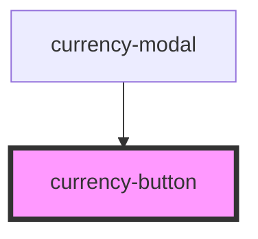

# currency-button

<!-- Auto Generated Below -->

## Properties

| Property         | Attribute     | Description | Type                         | Default     |
| ---------------- | ------------- | ----------- | ---------------------------- | ----------- |
| `currency`       | `currency`    |             | `string`                     | `'TKS'`     |
| `isSelected`     | `is-selected` |             | `boolean`                    | `false`     |
| `selectCurrency` | --            |             | `(currency: string) => void` | `undefined` |

## Dependencies

### Used by

 - [currency-modal](..)

### Graph

----------------------------------------------

*Built with [StencilJS](https://stenciljs.com/)*
