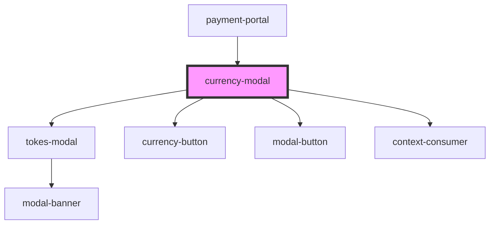

# currency-modal

<!-- Auto Generated Below -->

## Properties

| Property         | Attribute      | Description | Type                         | Default     |
| ---------------- | -------------- | ----------- | ---------------------------- | ----------- |
| `apiKey`         | `api-key`      |             | `string`                     | `undefined` |
| `orderData`      | --             |             | `Order`                      | `null`      |
| `referenceId`    | `reference-id` |             | `string`                     | `undefined` |
| `registerOrder`  | --             |             | `() => void`                 | `undefined` |
| `selectCurrency` | --             |             | `(currency: string) => void` | `undefined` |
| `url`            | `url`          |             | `string`                     | `undefined` |

## Events

| Event  | Description | Type               |
| ------ | ----------- | ------------------ |
| `exit` |             | `CustomEvent<any>` |

## Dependencies

### Used by

 - [payment-portal](../payment-portal)

### Depends on

- [tokes-modal](../tokes-modal)
- [currency-button](currency-button)
- [modal-button](../tokes-modal/modal-button)
- context-consumer

### Graph

----------------------------------------------

*Built with [StencilJS](https://stenciljs.com/)*
