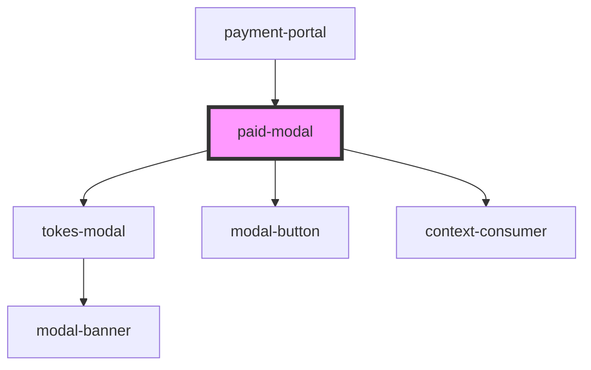

# paid-modal

<!-- Auto Generated Below -->

## Properties

| Property        | Attribute        | Description | Type      | Default     |
| --------------- | ---------------- | ----------- | --------- | ----------- |
| `apiKey`        | `api-key`        |             | `string`  | `undefined` |
| `orderData`     | --               |             | `Order`   | `undefined` |
| `paymentData`   | --               |             | `Payment` | `undefined` |
| `referenceId`   | `reference-id`   |             | `string`  | `undefined` |
| `statusMessage` | `status-message` |             | `string`  | `undefined` |
| `url`           | `url`            |             | `string`  | `undefined` |

## Events

| Event      | Description | Type               |
| ---------- | ----------- | ------------------ |
| `exit`     |             | `CustomEvent<any>` |
| `navigate` |             | `CustomEvent<any>` |

## Dependencies

### Used by

 - [payment-portal](../payment-portal)

### Depends on

- [tokes-modal](../tokes-modal)
- [modal-button](../tokes-modal/modal-button)
- context-consumer

### Graph

----------------------------------------------

*Built with [StencilJS](https://stenciljs.com/)*
