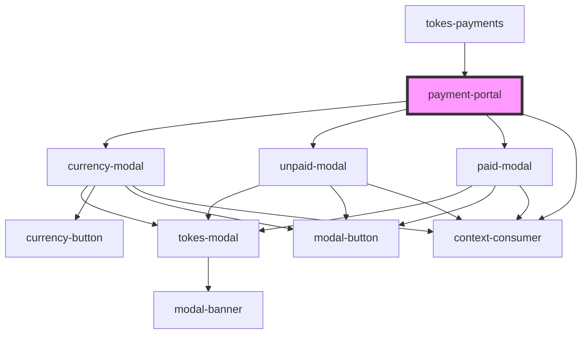

# payment-portal

<!-- Auto Generated Below -->

## Properties

| Property      | Attribute      | Description                         | Type         | Default     |
| ------------- | -------------- | ----------------------------------- | ------------ | ----------- |
| `apiKey`      | `api-key`      | API Key for merchant                | `string`     | `undefined` |
| `closeModal`  | --             | Close payment portal                | `() => void` | `undefined` |
| `referenceId` | `reference-id` | Order ID for previously setup order | `string`     | `undefined` |
| `url`         | `url`          | URL to lookup payment data          | `string`     | `undefined` |
| `usd`         | `usd`          | Total price in USD for order        | `number`     | `undefined` |

## Dependencies

### Used by

 - [tokes-payments](../tokes-payments)

### Depends on

- [currency-modal](../currency-modal)
- [unpaid-modal](../unpaid-modal)
- [paid-modal](../paid-modal)
- context-consumer

### Graph

----------------------------------------------

*Built with [StencilJS](https://stenciljs.com/)*
