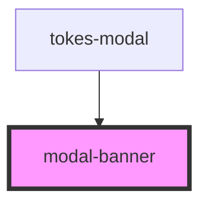

# modal-banner

<!-- Auto Generated Below -->

## Properties

| Property    | Attribute    | Description | Type      | Default     |
| ----------- | ------------ | ----------- | --------- | ----------- |
| `active`    | `active`     |             | `boolean` | `undefined` |
| `metaStyle` | `meta-style` |             | `string`  | `undefined` |

## Dependencies

### Used by

 - [tokes-modal](..)

### Graph

----------------------------------------------

*Built with [StencilJS](https://stenciljs.com/)*
