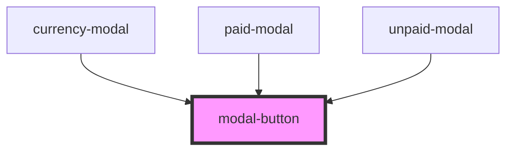

# modal-button

<!-- Auto Generated Below -->

## Properties

| Property    | Attribute    | Description | Type         | Default     |
| ----------- | ------------ | ----------- | ------------ | ----------- |
| `action`    | --           |             | `() => void` | `undefined` |
| `metaStyle` | `meta-style` |             | `string`     | `undefined` |

## Dependencies

### Used by

 - [currency-modal](../../currency-modal)
 - [paid-modal](../../paid-modal)
 - [unpaid-modal](../../unpaid-modal)

### Graph

----------------------------------------------

*Built with [StencilJS](https://stenciljs.com/)*
