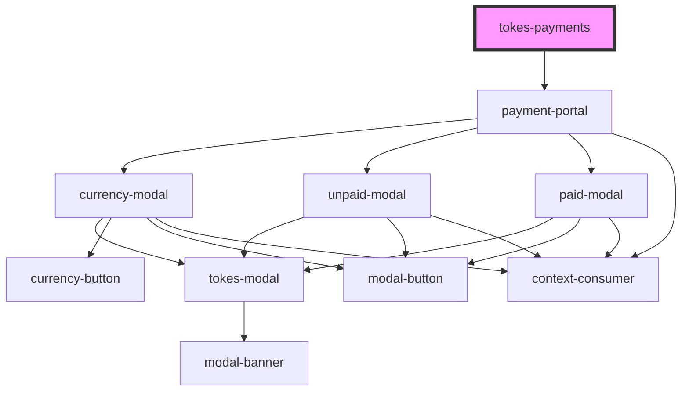

# tokes-payments

<!-- Auto Generated Below -->

## Properties

| Property        | Attribute        | Description                  | Type      | Default             |
| --------------- | ---------------- | ---------------------------- | --------- | ------------------- |
| `apiKey`        | `api-key`        | API Key for merchant         | `string`  | `undefined`         |
| `buttonContent` | `button-content` | Button Inner HTML            | `string`  | `'Pay with Crypto'` |
| `disabled`      | `disabled`       | Button disabled parameter    | `boolean` | `false`             |
| `referenceId`   | `reference-id`   | Reference ID for order       | `string`  | `undefined`         |
| `url`           | `url`            | URL to lookup payment data   | `string`  | `undefined`         |
| `usd`           | `usd`            | Total price in USD for order | `number`  | `undefined`         |

## Dependencies

### Depends on

- [payment-portal](../payment-portal)

### Graph

----------------------------------------------

*Built with [StencilJS](https://stenciljs.com/)*
